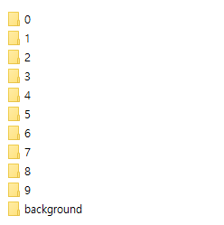
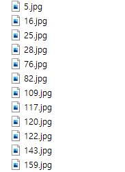

# open-set-loss
- backbone : mobilenetV2  
- Loss : Entropic Open-set Loss

&#160;

## Environment
- python 3.8
- torch, torchvision, torchasudio installed according to the CUDA you are using
```
pip install -r requirements.txt
```

&#160;

## Dataset structure
  

&#160;
User needs to collect the images by class as shown in the picture.

&#160;



&#160; 
Images are included as shown.

&#160; 

## How to train
```
python3 train.py --train_dataset_root {train_path} --validation_dataset_root {val_path} 
```

&#160;

## How to eval & export ONNX file
```
python3 test.py --dataset_root {test_path} --weight {weight_path} --export
```
- If the `export` option is given, an onnx file is created.

&#160;

[](https://hits.seeyoufarm.com)